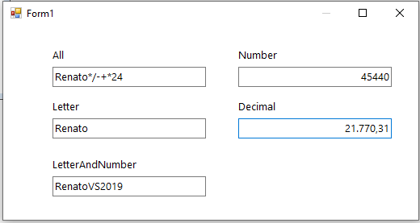

# TextBoxMask

TextBox with mask for numbers, letters and monetary ( Currency ).

TextBox com máscara para números, letras e monetária (moeda).

This control has mask for Letter, Number and decimal (Currency), applying mask to typing.

Este controle possui máscara para letra, número e decimal (moeda), aplicando máscara à digitação.

C# (Csharp)

